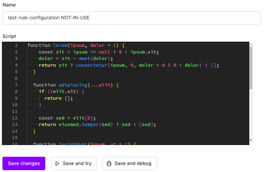
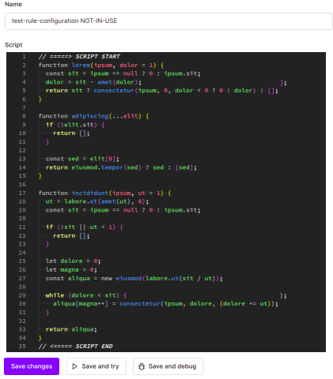

# Auth0 Script Editor Expander
Chrome extension for expanding that teeny weeny in-browser Script editor on auth0 dashboard.

Code window will be extended to 100% of the script's length. No more scroll bars!

## How to install

1. In Chrome, navigate to `chrome://extensions`  

2. Activate developer mode using the toggle on the top right.  
  

3. Click the "Load unpackaged"-button that just popped up and select `./extensionCode`-folder from this repo.

4. Extension is now enabled. Reload auth0 site if it does not work.  

-------
  
-Before
  

  
-After
